<div align="center">

# 🏏 IPL Data Analysis (2008–2023)

### A deep-dive into 16 seasons of Indian Premier League cricket using 10 custom analytical metrics


</div>

---

## 📋 Table of Contents

- [Project Overview](#-project-overview)
- [Dataset at a Glance](#-dataset-at-a-glance)
- [Toss & Strategy Analysis](#-toss--strategy-analysis)
- [Team Dominance & Resilience](#-team-dominance--resilience)
- [Venue & Ground Conditions](#-venue--ground-conditions)
- [Squad Dependency & Star Power](#-squad-dependency--star-power)
- [Temporal & Historical Trends](#-temporal--historical-trends)
- [Additional Insights](#-additional-insights)
- [Key Takeaways](#-key-takeaways)
- [Interactive Dashboard](#-interactive-dashboard)
- [How to Run](#-how-to-run)

---

## 🎯 Project Overview

This project analyzes **1,024 IPL matches** from the 2008 inaugural season through 2023, using **custom analytical metrics** to uncover patterns in team strategy, venue conditions, player impact, and championship efficiency.

Instead of reporting raw win/loss tallies, each metric is designed to answer a specific strategic question:

| Metric | Question It Answers |
|--------|-------------------|
| **TDY** — Toss Decision Yield | Does winning the toss and choosing bat/field actually help? |
| **TAC** — Toss Advantage Coefficient | Which teams are most dependent on the coin flip? |
| **MWDI** — Margin-Weighted Dominance Index | Do teams win convincingly or just scrape through? |
| **CMRI** — Close-Match Resilience Index | Who performs best under pressure in clutch games? |
| **VBS** — Venue Bias Score | Does a ground favour chasing or defending? |
| **FDR** — Fortress Dominance Ratio | How much stronger are teams at home vs. away? |
| **POM Concentration** | Is the team a one-man show or a collective effort? |
| **BMPI** — Big-Match Performance Index | Who steps up when it matters most — in playoffs? |
| **DMC** — Dynamic Momentum Coefficient | How do teams build and lose momentum within a season? |
| **TCE** — Title Conversion Efficiency | When a team reaches the final, do they seal the deal? |

---

## 📊 Dataset at a Glance

| Attribute | Value |
|-----------|-------|
| Total Matches | **1,024** |
| Seasons | **2008 – 2023 (16 seasons)** |
| Unique Teams | **18** (including defunct franchises) |
| Unique Venues | **56** |
| League Stage Matches | **972** |
| Playoff Matches | **52** |
| Won by Wickets | **542 (52.9%)** |
| Won by Runs | **468 (45.7%)** |
| Super Overs | **14 (1.4%)** |
| Avg. Winning Margin | **30.1 runs / 6.2 wickets** |
| Biggest Win | **146 runs \| 10 wickets** |

---

## 🎲 Toss & Strategy Analysis

### Toss Decision Yield (TDY)

> *Does winning the toss and choosing bat/field translate into wins?*

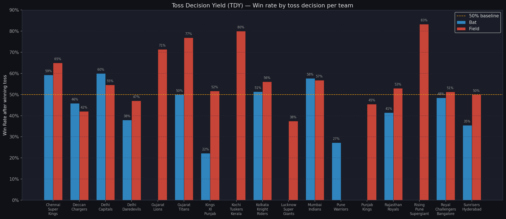

**Findings:**
- Winning the toss provides only a **marginal overall advantage** — toss winners win just **51.1%** of matches (barely above coin-flip odds)
- Teams that win the toss and **choose to field** win at **54.1%** — versus only **45.7%** for those who choose to bat
- The advantage comes entirely from the **strategy**, not the toss itself: the overall chase win rate across all IPL matches is **54.2%**
- **Chasing is the dominant strategy** in every era of IPL cricket

---

### Toss Advantage Coefficient (TAC)

> *Which teams rely on the toss — and which win regardless?*

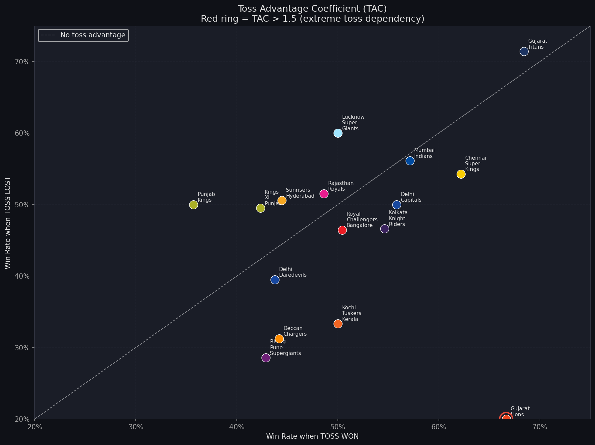

**How to read this chart:** Each dot is a team. The diagonal line = no toss advantage. Teams above the line win more when they *lose* the toss; teams below win more when they *win* it. Red circles = TAC > 1.5 (extreme toss dependency).

**Findings:**
- Established powerhouses (CSK, MI, KKR) cluster near the diagonal — their performance is driven by **squad quality, not luck**
- Newer or lower-resource teams show higher TAC — they need the toss to go their way more often
- The best teams are the ones whose win rate barely changes regardless of the toss outcome

---

## 💪 Team Dominance & Resilience

### All-Time Team Win Rates

| Team | Wins | Matches | Win Rate |
|------|------|---------|----------|
| 🥇 Gujarat Titans | 23 | 33 | **69.7%** |
| 🥈 Chennai Super Kings | 131 | 224 | **58.5%** |
| 🥉 Mumbai Indians | 140 | 247 | **56.7%** |
| Kolkata Knight Riders | 120 | 237 | 50.6% |
| Rajasthan Royals | 103 | 206 | 50.0% |
| Royal Challengers Bangalore | 116 | 240 | 48.3% |
| Pune Warriors | 12 | 46 | 26.1% |

> Gujarat Titans' 69.7% is over 33 matches (2022–23). CSK and MI's rates are most statistically significant with 200+ matches each.

---

### Margin-Weighted Dominance Index (MWDI)

> *Do teams win convincingly, or always on the edge?*

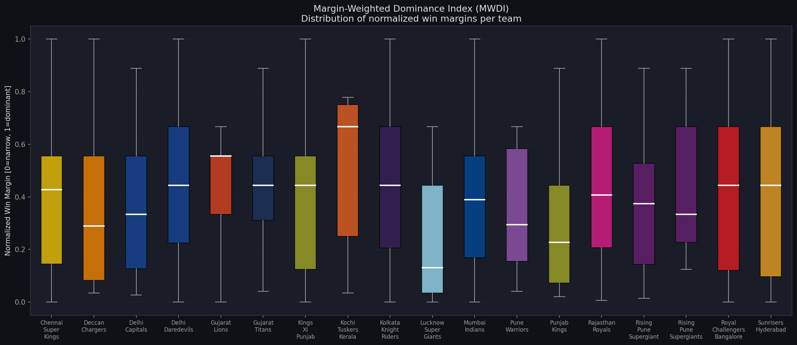

Win margins are normalized separately for runs-based and wickets-based wins (0 = narrow, 1 = dominant), then plotted as distributions per team.

**Findings:**
- **Chennai Super Kings** show a high median — they don't just win, they win *comfortably*
- **Royal Challengers Bangalore** have a wide interquartile range — when they win, it can be by a mile or by a whisker
- The league average winning margin is **30.1 runs** or **6.2 wickets**, showing most IPL wins are reasonably decisive

---

### Close-Match Resilience Index (CMRI)

> *Who wins the nail-biters? Who crumbles in clutch situations?*

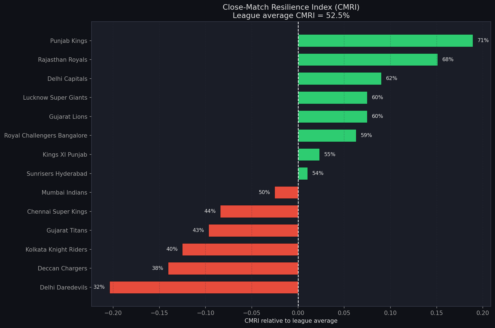

A **close match** is defined as: win by ≤ 10 runs, OR ≤ 3 wickets, OR decided by Super Over.
Bars extending right = above league-average clutch performance. Bars extending left = below average.

| Team | Close Wins | Close Games | CMRI |
|------|-----------|-------------|------|
| 🥇 **Punjab Kings** | 5 | 7 | **71.4%** |
| 🥈 **Rajasthan Royals** | 23 | 34 | **67.6%** |
| 🥉 **Delhi Capitals** | 8 | 13 | **61.5%** |
| Royal Challengers Bangalore | 20 | 34 | 58.8% |
| Chennai Super Kings | 15 | 34 | 44.1% |
| Kolkata Knight Riders | 18 | 45 | 40.0% |
| ⚠️ Delhi Daredevils | 9 | 28 | **32.1%** |

> There were **169 close matches** across 1,024 games (16.5%). **Rajasthan Royals** lead in absolute close wins (23) — they are the IPL's premier clutch team.

---

## 🏟️ Venue & Ground Conditions

### Venue Bias Score (VBS)

> *Does a ground favour the chasing team or the team batting first?*

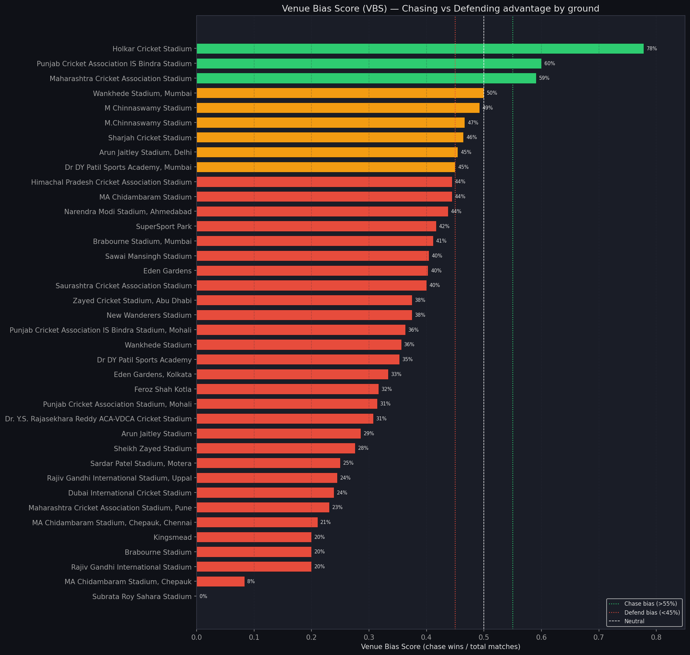

`VBS = chase wins / total matches at that venue`  
🟢 **> 0.55** = chasing bias | 🟠 **0.45–0.55** = neutral | 🔴 **< 0.45** = defending bias

**Most Extreme Venues:**

| Venue | VBS | Verdict |
|-------|-----|---------|
| Punjab CA IS Bindra Stadium | **0.60** | 🟢 Strong chase bias |
| Maharashtra CA Stadium | **0.59** | 🟢 Chase bias |
| Subrata Roy Sahara Stadium | **0.00** | 🔴 Extreme defend bias |
| **MA Chidambaram (Chepauk)** | **0.08** | 🔴 Strongest defend bias |
| Dubai International Stadium | 0.24 | 🔴 Defend bias |
| Wankhede Stadium | 0.36 | 🔴 Defend bias |

> 🚨 **Chepauk is the most bat-first-friendly ground in IPL history.** Teams batting first at MA Chidambaram Stadium win **92% of the time** — an extreme outlier driven by a slow, spinning pitch.

---

### Fortress Dominance Ratio (FDR)

> *How much stronger are teams at home compared to away?*

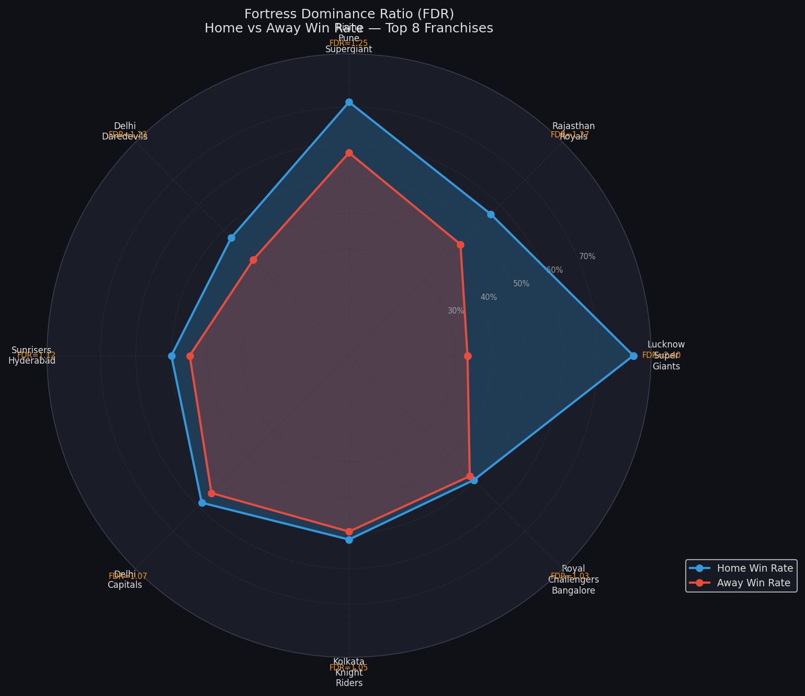

The radar chart compares Home Win Rate (blue) vs. Away Win Rate (red) for the top 8 franchises. A larger gap between the two polygons = stronger home fortress effect.

**Findings:**
- **Chennai Super Kings** show the largest home-away gap — Chepauk is a genuine fortress
- **Kolkata Knight Riders** at Eden Gardens similarly benefit from home advantage
- **Royal Challengers Bangalore** show a smaller FDR — their performance is more venue-independent (for better and worse)

---

## ⭐ Squad Dependency & Star Power

### Player of Match Concentration Index

> *Is the team a one-man show, or does everyone contribute?*

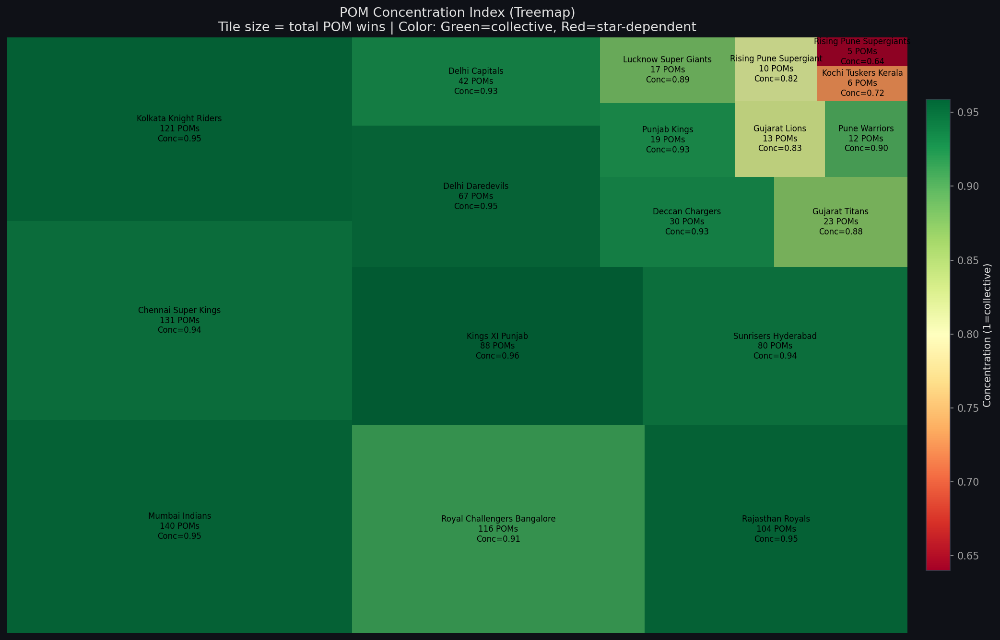

**Tile size** = total POM awards won by the team  
**Tile color** = Concentration Index (🟢 green = collective effort across many players, 🔴 red = dominated by a few stars)

The index uses a modified Herfindahl-Hirschman approach:  
`Score = 1 − Σ(player_share²)` → score near 1.0 = widely distributed awards

---

### All-Time Player of Match Leaders

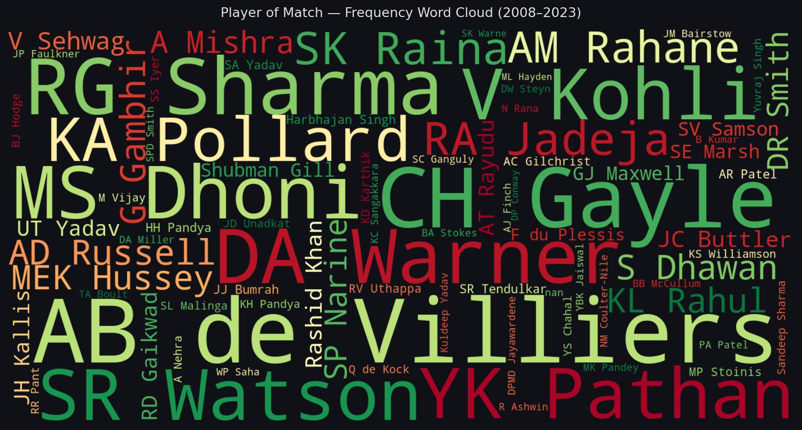

| Rank | Player | POM Awards |
|------|--------|-----------|
| 🥇 | **AB de Villiers** | **25** |
| 🥈 | **CH Gayle** | **22** |
| 🥉 | **RG Sharma (Rohit)** | **19** |
| 4 | DA Warner | 18 |
| 5 | MS Dhoni | 17 |
| 6 | SR Watson | 16 |
| 6 | V Kohli | 16 |
| 6 | YK Pathan | 16 |
| 9 | KA Pollard | 14 |
| 9 | RA Jadeja | 14 |

> **AB de Villiers** leads all-time with **25 POM awards** — averaging a match-winning performance once every ~9.6 matches.

---

### Big-Match Performance Index (BMPI)

> *Who steps up in playoffs when the pressure is highest?*

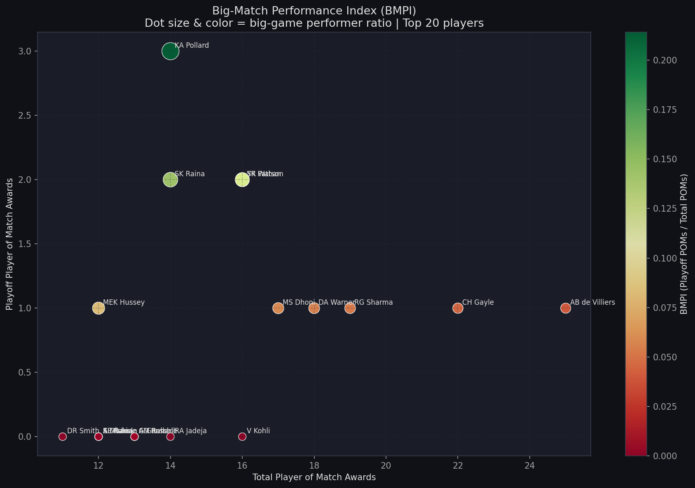

`BMPI = Playoff POM wins / Total POM wins`  
**Dot size & color** = BMPI ratio. Top-right dots with large size = elite big-game performers.

**Top Playoff Performers:**

| Player | Playoff POMs | Total POMs | BMPI |
|--------|-------------|------------|------|
| **KA Pollard** | 3 | 14 | **0.21** |
| **F du Plessis** | 3 | — | — |
| **SR Watson** | 2 | 16 | 0.13 |
| **A Kumble** | 2 | — | — |

> **Kieron Pollard** stands out as the premier "big game" player — 3 of his 14 POM awards came in knockout matches.

---

## 📈 Temporal & Historical Trends

### Dynamic Momentum Coefficient (DMC)

> *How do teams build and lose momentum across a season?*

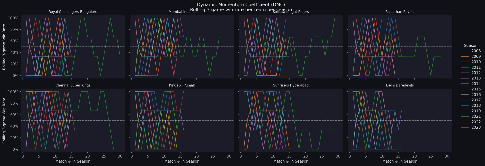

Rolling 3-match win rate per team per season. Each line is one IPL season; each panel is one franchise.

**Findings:**
- **Chennai Super Kings** run flat and consistent — their line rarely dips below 40% for extended stretches
- **Royal Challengers Bangalore** are the most volatile — dramatic rises and collapses within the same season
- Most playoff teams show a distinctive **upward curve** in the second half of the season as they hit peak form

---

### Title Conversion Efficiency (TCE)

> *When a team reaches the final — do they actually win it?*

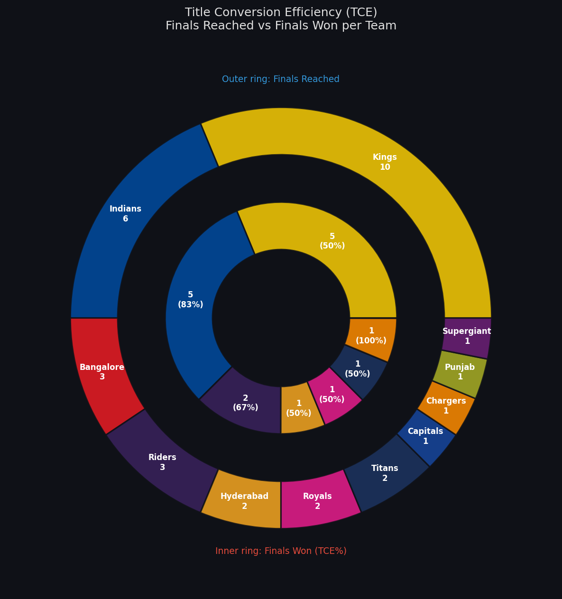

**Outer ring** = Finals reached | **Inner ring** = Finals won (with TCE%)

| Team | 🏆 Titles | Finals Reached | TCE |
|------|----------|----------------|-----|
| **Mumbai Indians** | **5** | **6** | **83%** 🥇 |
| **Kolkata Knight Riders** | 2 | 3 | **67%** |
| **Chennai Super Kings** | 5 | 10 | **50%** |
| Rajasthan Royals | 1 | 2 | 50% |
| Sunrisers Hyderabad | 1 | 2 | 50% |
| Gujarat Titans | 1 | 2 | 50% |
| Deccan Chargers | 1 | 1 | 100% |
| **Royal Challengers Bangalore** | **0** | 0 | **—** |

> 🏅 **Mumbai Indians** are the most efficient champions in IPL history — when they make the final, they win **83%** of the time. **CSK** have the most final appearances (10) but a lower conversion. **RCB** — despite 240 matches and consistent playoff appearances — have **never won** the IPL.

---

## 🔍 Additional Insights

### Head-to-Head Win Matrix

> *Which teams dominate their rivals across all-time records?*

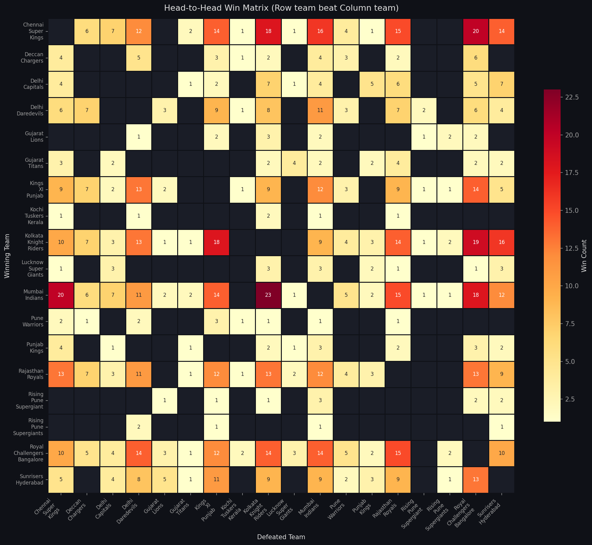

Row team's wins over column team. Darker cells = more dominant rivalry record.

**Top Rivalries:**

| Rivalry | Score | Matches |
|---------|-------|---------|
| **Mumbai Indians vs Kolkata Knight Riders** | **23 – 9** | 32 |
| Kolkata Knight Riders vs Punjab Kings | 21 – 11 | 32 |
| Mumbai Indians vs RCB | 18 – 14 | 32 |
| RCB vs Delhi Capitals | 18 – 11 | 30 |

> MI completely dominate KKR H2H (23–9 in 32 matches) — the most lopsided major rivalry in IPL history.

---

### Era Analysis — Chasing vs. Batting First

> *Has the balance between batting first and chasing shifted over 16 seasons?*

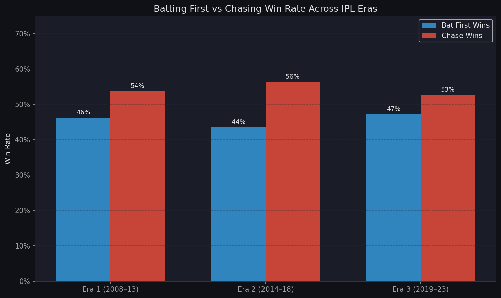

| Era | Matches | Bat First Win Rate | Chase Win Rate |
|-----|---------|-------------------|----------------|
| Era 1 (2008–13) | 398 | 46.2% | **53.8%** |
| Era 2 (2014–18) | 298 | 43.6% | **56.4%** ← Peak chase era |
| Era 3 (2019–23) | 328 | 47.3% | **52.7%** |

> **Era 2 (2014–18)** represents the golden age of T20 chasing — the gap between batting and chasing win rates peaked at 12.8 percentage points.

---

### Season-by-Season Win Rate Trends

> *How has each franchise evolved over 16 years?*

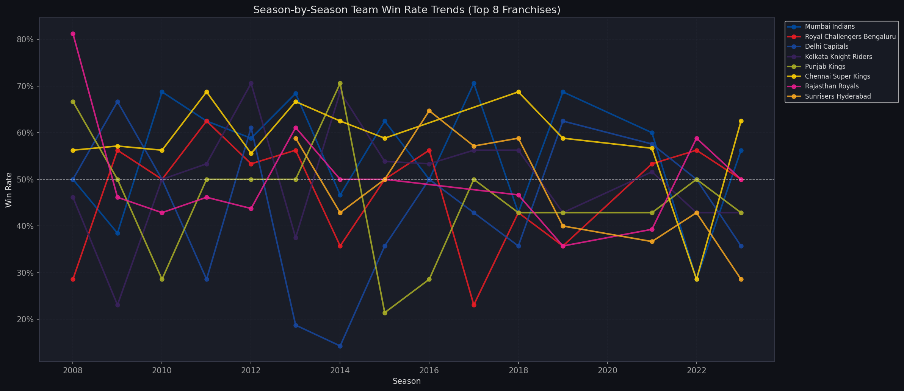

**Findings:**
- **CSK's consistency is unmatched** — their win rate barely dips below 50% in any season they participated
- **Mumbai Indians** show a distinctive pattern of alternating strong and average seasons, then dominating in playoff years
- **Gujarat Titans** exploded onto the scene with a 69.7% win rate in their debut season (2022)

---

### Venue × Toss Decision Interaction

> *At which grounds does the toss decision matter most?*

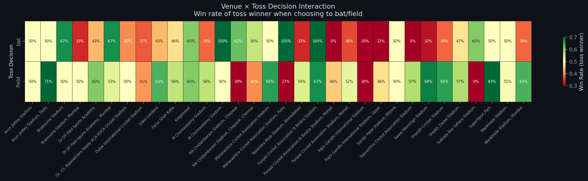

Each cell = win rate of toss winner when they choose that strategy at that venue.  
🟢 Dark green = choosing that strategy at that venue wins often | 🔴 Red = it backfires

**Key Venues:**
- **Chepauk**: Toss winners who choose to bat win at an extreme rate — field first here at your peril
- **UAE Venues (Dubai, Abu Dhabi)**: Field first is overwhelmingly correct — evening dew makes chasing easier
- **Eden Gardens**: More balanced — toss decision matters less here

---

### Super Over Analysis

> *Who thrives when matches go to the ultimate decider?*

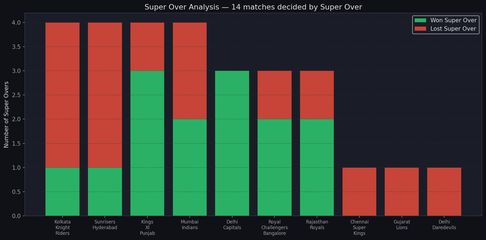

**14 Super Overs** across 1,024 matches (2008–2023):

- **2021** had **5 Super Overs** in a single season — the most dramatic year in IPL history
- **Delhi Capitals** appeared in 4 Super Overs, winning 3 — the best record
- **Mumbai Indians** and **Kings XI Punjab** each won 2 of their 3 Super Overs

---

## 🔑 Key Takeaways

| # | Finding | The Numbers |
|---|---------|-------------|
| 1 | **Chasing is king** — field first after winning the toss | 54.2% chase win rate vs. 45.8% batting first |
| 2 | **Chepauk is a batting fortress** | VBS = 0.08 → batting first wins 92% of the time |
| 3 | **Mumbai Indians are the most efficient champions** | 83% TCE — 5 titles from just 6 final appearances |
| 4 | **Rajasthan Royals are the IPL's clutch kings** | 67.6% CMRI — best among teams with 30+ close games |
| 5 | **AB de Villiers is the greatest match-winner** | 25 POM awards — most in IPL history |
| 6 | **CSK are the most consistent franchise** | 58.5% win rate over 224 matches; 10 final appearances |
| 7 | **RCB are the most star-dependent — and have no titles to show** | 0 titles despite 240 matches and superstar line-ups |
| 8 | **The toss matters less than you think** | Toss winner wins only 51.1% — barely above chance |
| 9 | **Era 2 (2014–18) was the peak of chasing dominance** | 56.4% chase win rate — the highest of the three eras |
| 10 | **MI utterly dominate KKR head-to-head** | 23 wins vs. just 9 in 32 meetings |

---

## 🖥️ Interactive Dashboard

The project includes a fully interactive, 5-tab HTML dashboard built with Plotly.

**Tabs:**
| Tab | Charts Inside |
|-----|--------------|
| 🎲 Toss Strategy | TDY grouped bar + Overall Chase vs. Defend |
| 💪 Clutch Analytics | CMRI diverging bar + MWDI box plot |
| 🏟️ Venue Insights | VBS ranked bar + H2H matrix |
| ⭐ Player Impact | BMPI dot plot + Top 15 POM winners |
| 📈 Season Trends | Season win rate lines (top 8 teams) |

**To open:** Download the repo and open `output/ipl_dashboard.html` in any modern browser (Chrome, Firefox, Edge). Requires an internet connection for the Plotly CDN.

---

## 🚀 How to Run

### 1. Clone the Repository

```bash
git clone https://github.com/Gowthamch9/ipl-analysis.git
cd ipl-analysis
```

### 2. Install Dependencies

```bash
pip install pandas matplotlib seaborn plotly squarify wordcloud
```

### 3. Run the Analysis

```bash
python workflows/ipl_analysis.py
```

All 16 charts and the interactive dashboard will be generated (or regenerated) in the `output/` folder. Expected runtime: ~60–90 seconds.

### 4. View the Dashboard

Open `output/ipl_dashboard.html` in your browser.

---

## 📁 Project Structure

```
ipl-analysis/
├── README.md                           ← You are here
├── ANALYSIS_REPORT.md                  ← Full detailed findings report
├── Dataset/
│   └── IPL_Dataset(2008 - 2023).csv    ← Source data (1,024 matches)
├── workflows/
│   └── ipl_analysis.py                 ← Complete analysis script (~1,100 lines)
└── output/
    ├── ipl_dashboard.html              ← Interactive 5-tab Plotly dashboard
    ├── tdy_grouped_bar.png
    ├── tac_scatter.png
    ├── mwdi_box.png
    ├── cmri_diverging.png
    ├── vbs_horizontal_bar.png
    ├── fdr_radar.png
    ├── pom_treemap.png
    ├── bmpi_dot.png
    ├── dmc_facetgrid.png
    ├── tce_donut.png
    ├── h2h_heatmap.png
    ├── era_chase_bat_bar.png
    ├── season_win_trend.png
    ├── venue_toss_heatmap.png
    ├── super_over_bar.png
    └── pom_wordcloud.png
```

---

<div align="center">

**Built with Python · pandas · matplotlib · seaborn · plotly · squarify · wordcloud**

*Data: IPL Matches 2008–2023*

</div>
